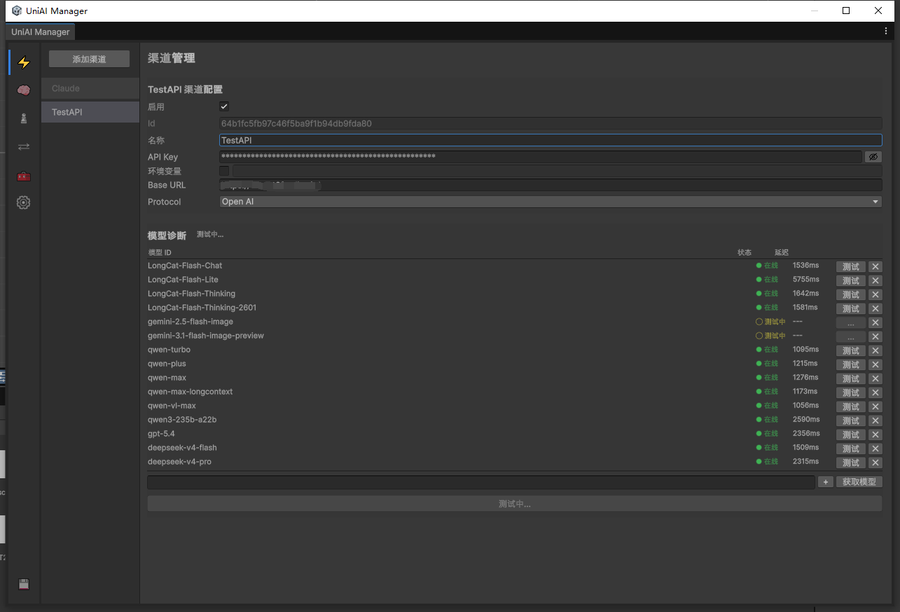
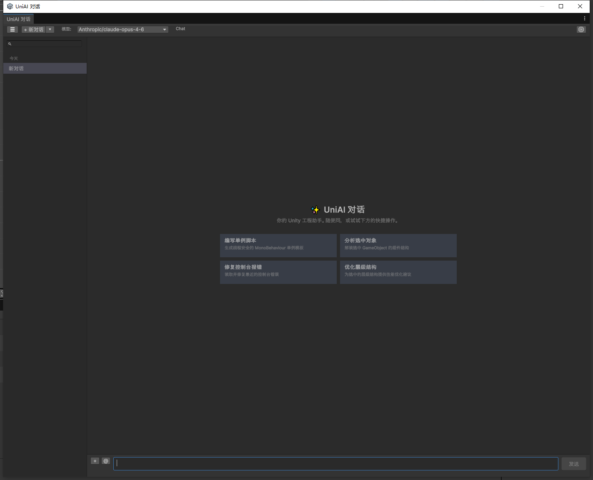

# UniAI

[](https://unity.com)
[](LICENSE)

UniAI 是面向 Unity 的 AI 交互框架，提供统一的 Chat、Agent、Tool、MCP、多模态、生成式资产和上下文窗口能力。框架既可用于 Unity Editor 助手，也可嵌入游戏 Runtime。

## 特性

- **多协议 Provider**: 内置 Claude Messages API 与 OpenAI Chat Completions 兼容协议，支持 DeepSeek、Gemini、Qwen、Grok 等 OpenAI-compatible 服务。
- **模型元数据 + Adapter/Dialect**: `ModelEntry` 描述能力、端点、行为和 `AdapterId`，模型差异由 adapter/dialect 处理，不在 Provider 主流程硬编码模型名。
- **SSE 流式响应**: 基于 `UnityWebRequest` 与自定义 SSE 解析实现流式输出。
- **多模态输入**: 支持文本、图片、文件附件混合消息。
- **Agent 与 Tool Use**: `[UniAITool]` 自动反射注册，`AIAgentRunner` 支持多轮 tool loop、工具结果回放和 reasoning 内容回放。
- **MCP Client**: 支持 Stdio 与 Streamable HTTP MCP Server，动态合并 Tools 与 Resources。
- **上下文窗口管理**: 支持 token 预估、滑动窗口、摘要压缩和 `IContextProvider` 外部上下文注入。
- **生成式资产**: 支持图片生成/编辑，OpenAI Images API 与 `gpt-image-2` 通过 image dialect 适配。
- **可扩展路由**: 对话 Provider、生成式 Provider、OpenAI Chat/Image dialect 通过 `AdapterAttribute` 自动发现。
- **Editor 工具链**: Manager 配置窗口、AI Chat 窗口、Agent/MCP/模型/工具管理。

## 环境要求

| 依赖 | 版本 |
| --- | --- |
| Unity | 2022.3+ |
| UniTask | 2.3.3+ |
| Newtonsoft.Json | Unity 内置或手动导入 |

## 安装

通过 Unity Package Manager 添加 Git URL：

```text
https://github.com/PiscesGameDev/UniAI.git
```

或手动克隆到项目：

```bash
git clone https://github.com/PiscesGameDev/UniAI.git Assets/UniAI
```

UniAI 依赖 UniTask。如项目未安装，可通过 Package Manager 添加：

```text
https://github.com/Cysharp/UniTask.git?path=src/UniTask/Assets/Plugins/UniTask
```

## 快速开始

### 1. 配置渠道

打开 `Window > UniAI > Manager`，在「渠道」Tab 中配置 Claude、OpenAI 或 OpenAI-compatible 服务。

<p align="center">
  
</p>

支持环境变量覆盖 API Key，例如：

- `ANTHROPIC_API_KEY`
- `OPENAI_API_KEY`
- `GEMINI_API_KEY`
- `DEEPSEEK_API_KEY`

代码创建直连客户端：

```csharp
using System.Collections.Generic;
using UniAI;

var client = AIClient.Create(new ChannelEntry
{
    Protocol = ProviderProtocol.OpenAI,
    ApiKey = "your-api-key",
    BaseUrl = "https://api.openai.com/v1",
    Models = new List<string> { "gpt-4o" }
});
```

### 2. 基础 Chat

```csharp
using Cysharp.Threading.Tasks;
using UnityEngine;
using UniAI;

var client = AIClient.Create(UniAISettings.Instance.ToConfig());

var response = await client.SendAsync(new AIRequest
{
    Model = "gpt-4o",
    SystemPrompt = "你是一个 Unity 游戏开发助手。",
    Messages =
    {
        AIMessage.User("如何优化 Draw Call？")
    }
});

if (response.IsSuccess)
    Debug.Log(response.Text);
```

流式响应：

```csharp
await foreach (var chunk in client.StreamAsync(request))
{
    if (!string.IsNullOrEmpty(chunk.DeltaText))
        Debug.Log(chunk.DeltaText);
}
```

结构化输出：

```csharp
var typed = await client.SendAsync<MyData>(new AIRequest
{
    Model = "gpt-4o",
    Messages = { AIMessage.User("返回 JSON 格式的角色属性") },
    ResponseFormat = AIResponseFormat.JsonSchema<MyData>()
});
```

多模态输入：

```csharp
var request = new AIRequest
{
    Model = "gpt-4o",
    Messages =
    {
        AIMessage.UserWithImage("分析这张截图", imageBytes, "image/png")
    }
};
```

## 模型注册表

`ModelRegistry` 统一管理模型元数据。模型元数据决定能力、默认端点、上下文窗口、行为标志和 adapter。

```csharp
var entry = ModelRegistry.Get("gpt-image-2");

bool canChat = ModelRegistry.HasCapability("gpt-4o", ModelCapability.Chat);
bool canGenerateImage = ModelRegistry.HasCapability("gpt-image-2", ModelCapability.ImageGen);
int contextWindow = ModelRegistry.GetContextWindow("deepseek-v4-pro");
ModelEndpoint endpoint = ModelRegistry.GetEndpoint("gpt-image-2");
```

自定义模型可在 Manager 的「模型」Tab 中添加，也可写入 `UniAISettings.CustomModels`。查找优先级为：用户自定义模型 > 内置预设。

重要字段：

- `Capabilities`: `Chat`、`VisionInput`、`ImageGen`、`ImageEdit`、`Embedding` 等。
- `Endpoint`: `ChatCompletions`、`ImageGenerations`、`ImageEdits` 等。
- `AdapterId`: 显式指定 provider-specific adapter/dialect。
- `Behavior`: 框架内置行为标志。
- `BehaviorTags` / `BehaviorOptions`: adapter 私有行为扩展。

## Adapter 与 Dialect

UniAI 使用 “模型元数据 + adapter/dialect” 处理模型差异。

核心机制：

- `AdapterAttribute` 声明 adapter id、目标扩展点、协议、能力、优先级。
- `AdapterDiscovery` 通过反射发现工厂。
- `AdapterRegistry<TFactory>` 负责按扩展点维护工厂。
- `AdapterCatalog` 为 Editor 提供可选 adapter 列表，并按 `ModelEntry + ChannelEntry` 过滤兼容项。

已使用的扩展点：

- `ConversationProvider`: 对话 Provider 工厂，例如 Claude / OpenAI。
- `OpenAIChatDialect`: OpenAI-compatible Chat 差异，例如 DeepSeek thinking reasoning replay。
- `ImageGenerationProvider`: 生成式资产 Provider 工厂。
- `OpenAIImageDialect`: OpenAI Images API 模型差异，例如 `gpt-image-2`。

新增 OpenAI-compatible Chat 方言时，实现 `IOpenAIChatDialectFactory` 并添加 `AdapterAttribute`。新增 OpenAI Images 模型差异时，实现 `IOpenAIImageDialectFactory`。新增生成式 Provider 时，实现 `IGenerativeProviderFactory`。

## Agent 与 Tool

### 自定义 Tool

使用 `[UniAITool]` 标记静态工具类，框架会自动扫描注册。

```csharp
[UniAITool(
    Name = "read_file",
    Group = ToolGroups.Core,
    Description = "Read file content. Actions: 'read'.",
    Actions = new[] { "read" })]
internal static class ReadFileTool
{
    public static async UniTask<object> HandleAsync(JObject args, CancellationToken ct)
    {
        var path = (string)args["path"];
        var text = await File.ReadAllTextAsync(path, ct);
        return ToolResponse.Success(new { text });
    }

    public class ReadArgs
    {
        [ToolParam(Description = "File path to read.")]
        public string Path;
    }
}
```

### Agent

在 Project 中创建 `Create > UniAI > Agent Definition`，配置：

- System Prompt
- Tool Groups
- Max Turns
- MCP Servers

代码运行 Agent：

```csharp
var runner = new AIAgentRunner(client, agentDefinition);

await foreach (var evt in runner.RunStreamAsync(messages))
{
    switch (evt.Type)
    {
        case AgentEventType.TextDelta:
            Debug.Log(evt.Text);
            break;
        case AgentEventType.ToolCallStart:
            Debug.Log($"Tool: {evt.ToolCall.Name}");
            break;
        case AgentEventType.ToolCallResult:
            Debug.Log(evt.ToolResult);
            break;
    }
}
```

Agent 内部已拆分为：

- `AgentLoop`: 多轮 tool loop 状态机。
- `AgentToolExecutor`: 本地 Tool 与 MCP Tool 执行。
- `ToolCallArgumentSanitizer`: 修复/规范化 tool arguments。
- `AgentMessageFactory`: 构造 assistant tool-call history。

## MCP

MCP Server 配置方式：

1. 创建 `Create > UniAI > MCP Server Config`。
2. 选择传输类型：
   - Stdio: 本地子进程，例如 `npx -y @modelcontextprotocol/server-filesystem .`
   - Streamable HTTP: 远程 MCP 服务。
3. 在 Inspector 中测试连接。
4. 将配置加入 `AgentDefinition.McpServers`。

Agent 启动时会自动连接启用的 MCP Server。MCP Tools 会合并到 Agent 可用工具中；MCP Resources 会通过 `McpResourceProvider` 注入 `ContextPipeline`。本地 `[UniAITool]` 与 MCP Tool 同名时，本地工具优先。

## 上下文窗口管理

`ContextPipeline` 负责长对话处理：

- token 预估
- 模型上下文窗口查询
- 滑动窗口保留最近消息
- AI 摘要旧消息
- `IContextProvider` 外部上下文注入

代码示例：

```csharp
var pipeline = new ContextPipeline(client);
pipeline.AddProvider(new MyContextProvider());

var processed = await pipeline.ProcessAsync(
    messages,
    systemPrompt,
    modelId,
    config.General.ContextWindow,
    session,
    ct);
```

Editor Chat 会通过 `ConversationContextPreparer` 注入 Unity 上下文，例如选中对象、Console、工程资源。Runtime 可通过 `IConversationContextProvider` 注入自己的上下文来源。

## 生成式资产

生成式资产通过模型能力和 adapter 自动路由。Editor 内置 `manage_generate` Tool，可由 Agent 自动调用；代码也可以直接使用 `GenerativeProviderRouter`。

```csharp
var config = UniAISettings.Instance.ToConfig();
var model = "gpt-image-2";
var entry = ModelRegistry.Get(model);
var channels = config.FindChannelsForModel(model);

var route = GenerativeProviderRouter.Resolve(channels, entry, model, config.General);
if (route.Provider == null)
{
    Debug.LogError(route.Error);
    return;
}

var result = await route.Provider.GenerateAsync(new GenerateRequest
{
    Prompt = "A stylized Unity editor robot mascot",
    AssetType = GenerativeAssetType.Image,
    Size = "1024x1024",
    Quality = "auto",
    OutputFormat = "png",
    Count = 1
}, ct);
```

`gpt-image-2` 通过 `openai.images.gpt-image-2` image dialect 适配生成和编辑请求。图片编辑会根据 dialect 使用 JSON 或 multipart/form-data。

## 对话编排

`ChatOrchestrator` 是对话生命周期编排层，当前职责保持很薄：

- 管理流式状态和取消。
- 等待 MCP 初始化。
- 调用 `ConversationContextPreparer` 准备消息。
- 调用 `IConversationRunner`。
- 用 `AgentEventSessionApplier` 将事件应用到 `ChatSession`。
- 在结束时触发保存和标题策略。

可注入策略：

- `IConversationContextProvider`: 外部上下文来源。
- `IChatSessionPersistence`: 会话保存策略。
- `IChatTitlePolicy`: 标题生成策略。
- `ToolExecutionGuardFactory`: 工具执行守卫，例如 Editor 中的 `EditorAgentGuard`。

```csharp
var orchestrator = new ChatOrchestrator();
orchestrator.Configure(new ChatOrchestratorDependencies
{
    ContextProvider = NullConversationContextProvider.Instance,
    Persistence = new ChatHistorySessionPersistence(history),
    TitlePolicy = new FirstUserMessageTitlePolicy()
});

orchestrator.EnsureRuntime(config, modelSelector, agentDefinition);

await orchestrator.StreamResponseAsync(new ChatStreamRequest
{
    Session = session,
    ContextSlots = 0,
    Config = config,
    ModelId = modelSelector.CurrentModelId
});
```

## Editor 工具

### Manager

菜单：`Window > UniAI > Manager`

主要 Tab：

- **渠道**: 管理 API Key、BaseUrl、模型列表、环境变量覆盖、连接测试。
- **模型**: 查看内置模型，添加自定义模型，配置能力、端点、adapter、行为参数。
- **Agent**: 创建和管理 Agent Definition。
- **工具**: 查看所有 `[UniAITool]` 工具。
- **MCP**: 管理 MCP Server Config，测试连接。
- **设置**: 请求超时、日志级别、上下文窗口、Tool、MCP、Editor 偏好。

### Chat

菜单：`Window > UniAI > Chat`

<p align="center">
  
</p>

能力：

- 多模型切换。
- Agent 选择。
- SSE 流式输出。
- Tool 调用过程可视化。
- MCP 状态显示。
- 自动历史保存和标题生成。
- Markdown 渲染和代码复制。
- Unity 上下文注入。
- 图片/文件附件。
- 生成式图片结果展示。

## 架构概览

```text
Runtime/
├── Core/
│   ├── AIClient / ChannelManager
│   ├── ChannelRouteSelector / ProviderCache / AIProviderFactoryRegistry
│   ├── Adapters/
│   │   ├── AdapterAttribute / AdapterCatalog
│   │   └── AdapterRegistry / AdapterDiscovery
│   ├── ChatOrchestrator
│   ├── ConversationRuntimeFactory / ConversationRuntime
│   ├── ConversationContextPreparer
│   ├── McpConversationInitializer
│   ├── AgentEventSessionApplier
│   └── ChatSessionPolicies
├── Models/
│   └── AIRequest / AIResponse / AIMessage / AIContent / AITool / AIStreamChunk
├── Providers/
│   ├── Claude/
│   ├── OpenAI/
│   │   └── Chat/
│   ├── IAIProvider / IAIProviderFactory
│   └── JsonSseProviderBase
├── Agent/
│   ├── AIAgentRunner / AgentLoop / AgentToolExecutor
│   └── UniAIToolRegistry / ToolSchemaGenerator / ToolResponse
├── Chat/
│   └── ChatSession / ChatHistoryManager / FileChatHistoryStorage
├── Context/
│   └── ContextPipeline / TokenEstimator / MessageSummarizer / IContextProvider
├── MCP/
│   └── McpClientManager / McpClient / Transports / McpResourceProvider
├── Generative/
│   ├── GenerativeProviderRouter / IGenerativeProviderFactory
│   └── Providers/OpenAI/Images/
└── Http/
    └── AIHttpClient / SSEDownloadHandler / SSEParser
```

Editor 层主要负责 Unity UI 和 Editor 特有注入：

```text
Editor/
├── Setting/                 # Manager 窗口和配置 Tab
├── Chat/                    # Chat 窗口、StreamingController、ContextCollector
├── Agent/                   # Agent 资产扫描和 Inspector
├── MCP/                     # MCP Server 管理和 Inspector
└── Tools/                   # Editor 内置 [UniAITool]
```

## 扩展点

### 自定义直连 Provider

如果只想在代码中直接调用，可实现 `IAIProvider`：

```csharp
public sealed class MyProvider : IAIProvider
{
    public string Name => "MyProvider";

    public UniTask<AIResponse> SendAsync(AIRequest request, CancellationToken ct)
    {
        throw new NotImplementedException();
    }

    public IUniTaskAsyncEnumerable<AIStreamChunk> StreamAsync(AIRequest request, CancellationToken ct)
    {
        throw new NotImplementedException();
    }
}

var client = new AIClient(new MyProvider());
```

### 自定义 Adapter

框架级扩展建议优先使用 adapter 工厂：

- `IAIProviderFactory`: 对话 Provider 路由。
- `IOpenAIChatDialectFactory`: OpenAI-compatible Chat 模型差异。
- `IGenerativeProviderFactory`: 生成式资产 Provider 路由。
- `IOpenAIImageDialectFactory`: OpenAI Images 模型差异。

所有工厂通过 `[Adapter(...)]` 自动发现。Editor 的模型编辑界面会通过 `AdapterCatalog` 展示与模型和渠道兼容的 adapter。

## 配置与存储

配置来源：

| 优先级 | 来源 | 说明 |
| --- | --- | --- |
| 1 | 环境变量 | `ChannelEntry.EnvVarName + UseEnvVar` 覆盖 API Key |
| 2 | `UniAISettings.asset` | `Assets/Resources/UniAI/` 下的运行时配置 |

会话历史默认使用 `FileChatHistoryStorage`，Editor 存储在 `Library/UniAI/History`。Runtime 可通过 `IChatSessionPersistence` 注入自己的保存方式。

## 许可证

Apache License 2.0 - Copyright 2025 PiscesGameDev
